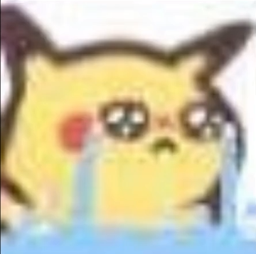
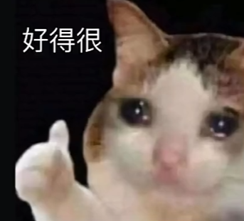

# 随笔记

## 230111
有一种期待是你的快递正在路上

每天早上睡在床上刷抖音 直到干了鸡汤才能起来

别贪心，你不可能什么都有 别焦虑，你不可能什么都没有

早上想到一个好玩的话，妈的现在怎么也都想不起来了，😫
妈的，翻了一边抖音才翻到 😄

## 230110

我也坚信爱一个人就要去了解她的过去他的性格他的三观，他的朋友是什么样的，他如何对待自己的家人，要花费很久的时间去了解再下定决心去爱。

所以请继续保持热爱，做自己，我也在等

为什么一和女生聊天我就会很敏感？

太浮躁了，每天都想着谁谁找我玩，期待太多而不得的浮躁

## 230107

今天没有充电  

拒绝比较心♥  忠于自己 热爱生活 自己喜欢的日子就是最好的日子

突然意识到2018已是五年前了

学会胡说八道

所以暂时将眼睛闭了起来😣     --想见你后遗症😂

要学会销声匿迹😐

## 230106

你是我的小蝴蝶 我是你的小阿飞 哈哈哈 代入感拉满了

今天看到的emo贴：

  当你放肆做自己的时候，他就会爱上你

  靠时间忘记的人再见面还是会心动吗？ 

  { width="50"}

  不会了，我试过。没见面时会一直保留一份幻想，但是再见面后发现已经物是人非了，在那一瞬间所有幻想都会灰飞烟灭。😭😭😭

   { width="50"}

  你是怎么做到喜欢却不联系的?

  程序未响应，请问您要结束程序还是继续等待 

  等待按多了，程序会卡死。只有结束程序，才是解脱。

  { width="50"}

尚硅谷git 完结撒花👍 明天开冲spring

加油，做自己，慢慢来吧，应该会遇到带着真诚的人的吧

## 230105

竟有人再次遇见五年没见的白月光时紧张到说不出话

今天的健身又放弃了

尚硅谷的git教程真不错

